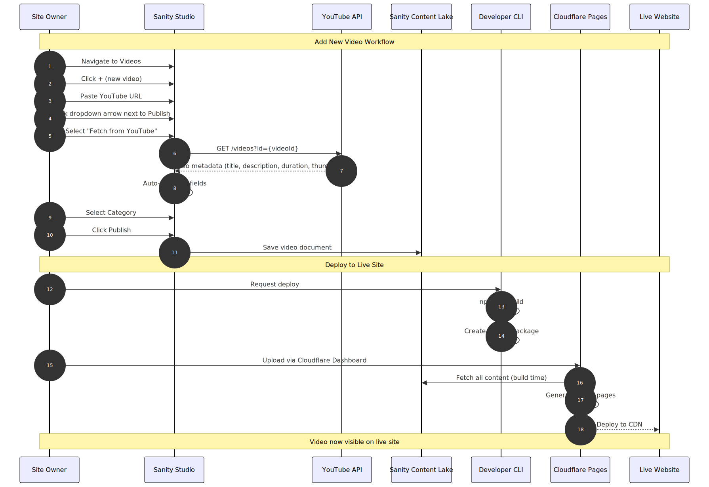
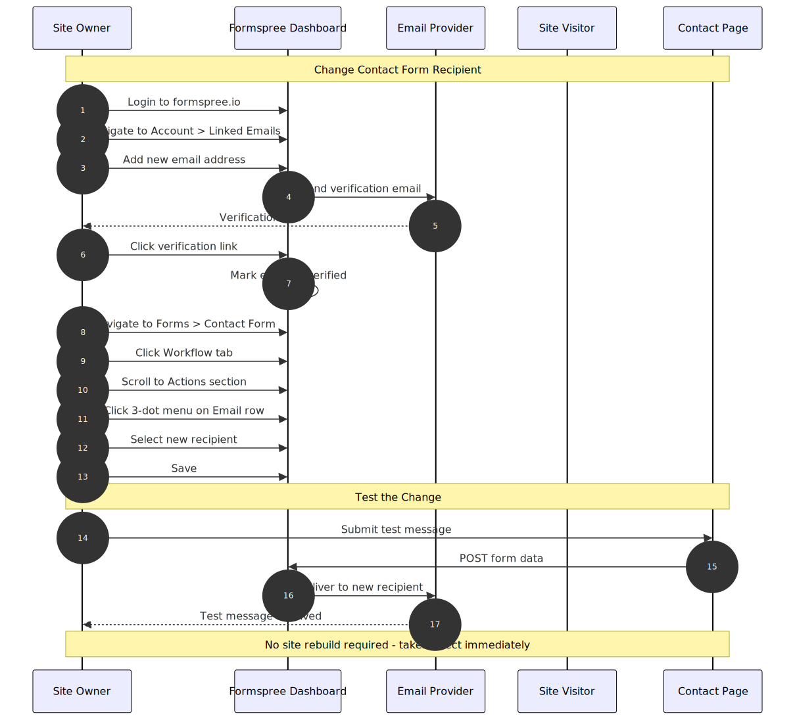
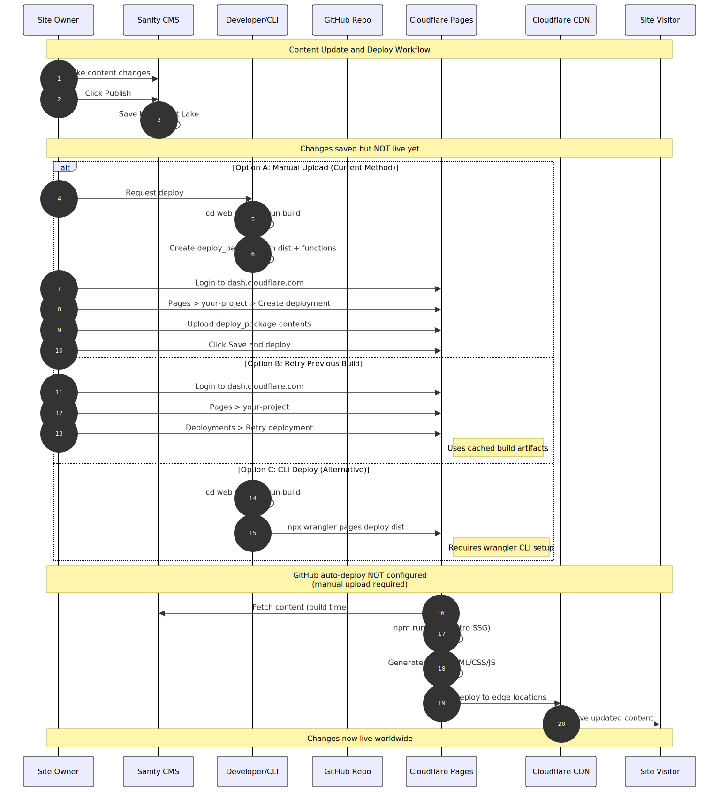
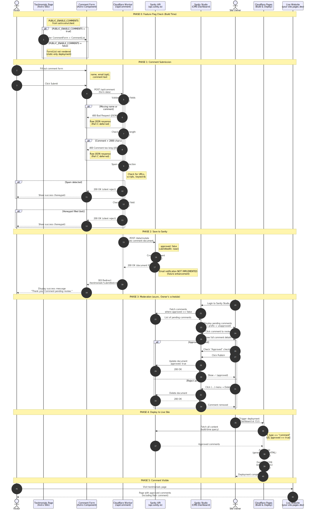

# Example Studio - System Diagrams

This document contains architecture and workflow diagrams for the website maintenance use case.

---

## 1. System Context Diagram

Shows the high-level view of all systems and actors involved.

**Actors:**
- **Site Owner** - Manages content, receives contact messages
- **Site Visitor** - Views site, watches videos, sends messages

**External Services:**
- Sanity CMS - Content management
- Cloudflare Pages - Hosting and CDN
- Formspree - Contact form handling
- YouTube - Video hosting
- Google Cloud - YouTube Data API

---

## 2. Container Diagram

Shows the detailed components and their relationships.

**Key Components:**
- **Sanity Studio** - Web-based content editor
- **Content Lake** - Sanity's document database
- **Document Actions** - Custom "Fetch from YouTube" button
- **Astro SSG** - Static site generator
- **Cloudflare CDN** - Global content delivery

---

## 3. Add Video Workflow

Step-by-step sequence for adding a new video to the site.

**Summary:**
1. Navigate to Videos in Sanity Studio
2. Click + to create new video
3. Paste YouTube URL
4. Click dropdown > "Fetch from YouTube"
5. Select category and publish
6. Deploy to make live

---

## 4. Change Email Recipient Workflow

Step-by-step sequence for changing the contact form email recipient.

**Summary:**
1. Add new email in Formspree Account settings
2. Verify the email address
3. Go to Forms > Contact Form > Workflow tab
4. Find Email action, click 3-dot menu
5. Select new recipient
6. Test with a form submission

---

## 5. Deploy Changes Workflow

Step-by-step sequence for deploying content changes to the live site.

**Three Options:**
- **Option A:** Ask developer to run deploy command
- **Option B:** Use Cloudflare dashboard (Retry deployment)
- **Option C:** Push to GitHub (triggers automatic build)

---

## 6. Comment System Workflow

Step-by-step sequence for visitor comment submission and moderation.

**Phases:**

1. **Submission:** Visitor fills form, Cloudflare Worker validates and checks for spam
2. **Save:** Worker creates comment in Sanity with `approved: false`
3. **Moderation:** Owner reviews in Sanity Studio, approves or deletes
4. **Auto-Deploy:** Webhook triggers Cloudflare rebuild when comment approved
5. **Display:** Approved comment appears on live site

**Key Points:**
- Spam is silently rejected (no error shown to spammer)
- Owner does not need to manually deploy - webhook handles it
- Only approved comments display on the site

---

*Generated: 2026-05-29*
*Updated: 2026-06-07 (added comment system)*
*Project: Example Studio*
