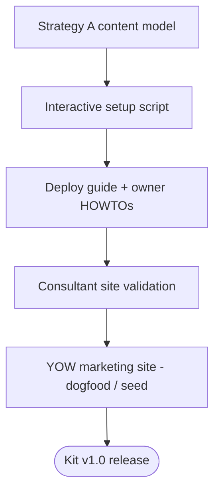

# Vision: The Distributable YOW Kit

## Document Control

| Field | Value |
|-------|-------|
| Document ID | VISION-YOW-001 |
| Type | VI |
| Version | 1.1 |
| Status | DRAFT |
| Classification | INTERNAL |
| Registered | [ ] Yes - doc_create in ILM |

| Field | Value |
|-------|-------|
| Created | 2026-06-09 |
| Last Updated | 2026-06-09 |
| Author | LIBRARIAN_20260607_115253_968738 |
| Owner | PRODUCT-MGR |

| Lineage | Document |
|---------|----------|
| Parent Vision | VISION-YOS-2026 (platform) |
| Supersedes | N/A |
| Superseded By | N/A |

| Vision Horizon | 2026-Q3 (provisional — see §10) |
| Review Cadence | Quarterly |

---

## Change History

| Version | Date | Author | Changes |
|---------|------|--------|---------|
| 0.1 | 2026-06-09 | Cowork session | Initial draft |
| 1.0 | 2026-06-09 | LIBRARIAN | Template compliance rewrite |
| 1.1 | 2026-06-09 | Cowork session | Content reconciliation: corrected spec dependency references; replaced placeholder revenue motive, timeline dates, and resourcing with decisions of record / TBD; dated gantt → dateless dependency flow |

---

## Index Terms

vision, YOW, your own website, distributable kit, static site,
Sanity CMS, Cloudflare, zero-cost hosting, non-technical owner,
small business website, Astro, content management

---

## Purpose

Define the vision for the **kit-ification iteration (N+1)**:
converting the proven original pilot project into a free,
distributable kit that a stranger can deploy and a non-technical
owner can maintain.

---

## 1. Executive Summary

The YOW Distributable Kit transforms a successful pilot website
into a reusable template that democratizes professional web
presence for small businesses. The kit enables anyone with minimal
technical skill to deploy a professional website at zero ongoing
cost, while allowing non-technical owners to maintain content
entirely through a CMS interface.

This iteration focuses on download-based distribution with an
interactive setup script, a generic content model (Strategy A),
and curated themes. Success is measured by a stranger's ability
to deploy without source edits and validation through an
arms-length consultant site.

The vision builds on the completed portability trilogy
(SPEC-YOW-001/002/003) and defers features above the "Tier 3
Cliff" to future iterations.

---

## 2. Vision Statement

### 2.1 The Vision

A person with **minimal technical skill** can download YOW, point
it at their own free Sanity and Cloudflare accounts, and have a
professional website live at **no ongoing cost** — and a
**non-technical owner** can keep it current entirely through the
CMS, never touching source.

### 2.2 Mission

Ship an opinionated, accessible kit with a generic content model
whose generality is *proven* by generating sites unlike the pilot.
Concentrate value in curation, deploy-ease, and maintain-over-time
while treating render, host, store, and CMS as commodity.

### 2.3 Core Values

| Value | Description |
|-------|-------------|
| Ownership | State and control stay in the owner's hands |
| Zero Cost | No ongoing fees on free tiers |
| Self-Service | Non-technical owners never need help |
| Simplicity | Opinionated defaults over configuration |

---

## 3. Problem Statement

### 3.1 Current Challenges

| Challenge | Impact | Urgency |
|-----------|--------|---------|
| Small businesses lack affordable web presence | Lost customers, weak credibility | HIGH |
| Existing solutions require ongoing dev costs | Unsustainable for micro-businesses | HIGH |
| Website builders lock in content/control | Vendor dependency, data loss risk | MEDIUM |
| Technical complexity excludes non-developers | Large underserved market | HIGH |

### 3.2 Why Now

The original pilot project has proven the technical approach
works, and the Sanity and Cloudflare free tiers supply the
infrastructure at zero cost. The missing piece is packaging the
proven stack for non-technical deployment — which is exactly the
N+1 kit-ification scope.

---

## 4. Target Audience

### 4.1 Primary Users

| Persona | Description | Key Needs |
|---------|-------------|-----------|
| Deployer | Minimal skills; can follow instructions, run scripts | Get site live without coding |
| Owner | No technical skills; uses CMS only | Keep site current without help |

### 4.2 Secondary Stakeholders

| Stakeholder | Interest | Influence |
|-------------|----------|-----------|
| Kit Maintainer | Ship fixes to deployed sites | HIGH |
| YOW Team | Platform adoption; the democratize-web-presence mission | HIGH |
| Pilot Users | Continued support, migration path | MEDIUM |

> Note: YOW is a free kit. No monetization/revenue motive is
> assumed in this iteration; if that changes it is a PRODUCT-MGR
> decision to record here.

---

## 5. Strategic Goals

### 5.1 Goal Summary

| Goal | Description | Success Metric | Target |
|------|-------------|----------------|--------|
| G1 | Zero-edit deployment | Source edits required | 0 |
| G2 | CMS-only maintenance | Tasks requiring code | 0 |
| G3 | Arms-length validation | Consultant site deploys | Yes |
| G4 | Dogfood validation | YOW marketing site on kit | Yes |

### 5.2 Goal Details

#### Goal 1: Zero-Edit Deployment

**Description:** A stranger downloads the kit, runs setup, and
deploys their own site with zero source code edits.

**Rationale:** Source edits are the barrier that excludes
non-developers. Eliminating them opens the market.

**Key Results:**
- Interactive setup script handles all configuration
- Environment variables externalize all instance-specific values
- Documentation covers every deployment step

**Dependencies:** SPEC-YOW-001 (configuration externalization,
COMPLETE); the new interactive setup script (this iteration).

---

#### Goal 2: CMS-Only Maintenance

**Description:** A non-technical owner performs every routine
content task in the CMS without touching source or CLI.

**Rationale:** This is the product's core value proposition.
If owners need developer help for routine tasks, the product fails.

**Key Results:**
- All content editable in Sanity Studio
- Site settings (name, theme, contact) in CMS `siteSettings`
- Owner HOWTOs cover every routine task

**Dependencies:** SPEC-YOW-002 (content abstraction / provider
seam, COMPLETE); SPEC-YOW-003 (comments isolated & optional,
COMPLETE).

---

#### Goal 3: Arms-Length Validation

**Description:** The kit successfully generates a consultant site
(unrelated to the pilot domain) with zero source edits.

**Rationale:** Proves the content model is truly generic, not
over-fitted to the sailing pilot.

**Key Results:**
- Consultant site deployed and live
- No source modifications required
- Content model handles a different domain

**Dependencies:** Strategy A generic content model (this
iteration).

---

#### Goal 4: Dogfood Validation

**Description:** The YOW marketing site is itself built on the kit,
serving as the default seed/demo content.

**Rationale:** Eating our own dogfood ensures quality and provides
a live reference implementation; its content seeds new deployments.

**Key Results:**
- YOW marketing site live on the kit
- Serves as demo/seed content for new deployments
- Any gaps it reveals feed the Strategy A vs B decision

**Dependencies:** G1, G2, G3.

---

## 6. Success Criteria

### 6.1 Qualitative Measures

| Criterion | Description | How Evaluated |
|-----------|-------------|---------------|
| Deploy ease | Non-dev can follow guide | User testing |
| Content editing | Owner can update without help | User testing |
| Documentation | Guides are complete, clear | Review + testing |

### 6.2 Quantitative Measures

| Metric | Baseline | Target | When |
|--------|----------|--------|------|
| Source edits for deploy | N/A | 0 | by v1.0 |
| CLI commands for owner | N/A | 0 | by v1.0 |
| Setup script steps | N/A | ≤ ~10 | by v1.0 |
| Documentation pages | 0 | 5+ | by v1.0 |
| Accessibility | pilot AA | WCAG 2.1 AA | by v1.0 |

> Targets are provisional pending PRODUCT-MGR sign-off; see
> NFR-YOW-001 for the authoritative measures.

---

## 7. Scope

### 7.1 In Scope

- Download-based distribution (GitHub release / zip)
- Interactive setup script (no git skills required)
- Generic Strategy A content model
- Curated themes
- Per-instance configuration via env + CMS `siteSettings`
- Optional-feature toggles
- Generic documentation (deploy guide + owner HOWTOs)
- Generalization validation via consultant site

### 7.2 Out of Scope

| Item | Reason | Future Consideration |
|------|--------|----------------------|
| User accounts/login | Above Tier 3 Cliff | N+3+ |
| Per-user data | Above Tier 3 Cliff | N+3+ |
| Account-bearing sales | Above Tier 3 Cliff | N+3+ |
| Authoring substrate swap | N+2 scope | N+2 |
| Real-time features | Declined | None |
| Automatic updates | Complexity vs value | Package model (future) |

Note: Simple hosted-link payment remains available as an optional
below-cliff embed but is not core to this iteration.

---

## 8. Constraints and Assumptions

### 8.1 Constraints

| Constraint | Type | Impact |
|------------|------|--------|
| Zero ongoing cost | BUDGET | Must use free tiers only |
| No git skills | RESOURCE | Setup must avoid git |
| Sanity/Cloudflare dependency | TECH | Tied to specific vendors (seam keeps them swappable) |
| Downloaded snapshot | TECH | No automatic update path |

### 8.2 Assumptions

| Assumption | If Invalid |
|------------|------------|
| Sanity free tier remains adequate | Evaluate alternatives |
| Cloudflare Pages free tier persists | Evaluate alternatives |
| Users can create online accounts | Provide account setup guide |
| Strategy A model is generic enough | Reconsider Strategy B (block model) |

---

## 9. Risks

| Risk | Prob | Impact | Mitigation |
|------|------|--------|------------|
| No-skills editing fails | MED | HIGH | Extensive user testing |
| Update path unclear | HIGH | MED | Document, pin deps, re-download process; package model later |
| Schema over-fit to pilot | MED | HIGH | Validate with arms-length consultant site |
| Vendor free tier changes | LOW | HIGH | Provider seam keeps CMS/host swappable |
| Setup script fragility | MED | MED | Test on clean machines |

---

## 10. Timeline

> **Dates are not yet committed.** The sequence and dependencies
> below are decisions of record; calendar dates are TBD pending
> PRODUCT-MGR scheduling. The prior draft's specific dates were
> placeholder values and have been removed.

### 10.1 Key Milestones

| Milestone | Target Date | Dependencies |
|-----------|-------------|--------------|
| Strategy A content model | TBD | SPEC-YOW-002 |
| Interactive setup script | TBD | Content model |
| Deploy guide + owner HOWTOs | TBD | Setup script |
| Consultant site validation | TBD | All above |
| YOW marketing site (dogfood) | TBD | Consultant validation |
| Kit v1.0 release | TBD | All above |

### 10.2 Dependency Flow

---

## 11. Resource Requirements

> Proposed allocation — TBD, PRODUCT-MGR to confirm.

| Resource Type | Quantity | Timeline | Notes |
|---------------|----------|----------|-------|
| CODER | TBD | TBD | Setup script, generalization, integration |
| ARCHITECT | TBD | TBD | Content-model review |
| LIBRARIAN | TBD | TBD | Documentation, ILM registration |
| Test users | 2–3 | TBD | Non-technical volunteers |

---

## 12. Related Documents

| Document | Type | Relationship |
|----------|------|--------------|
| VISION-YOS-2026 | VI | Parent platform vision |
| SPEC-YOW-001 | SPEC | Sanity configuration via env (COMPLETE) |
| SPEC-YOW-002 | SPEC | Content abstraction layer (COMPLETE) |
| SPEC-YOW-003 | SPEC | Comment system isolation (COMPLETE) |
| PLAN-YOW-001 | PLAN | Program model, decision filter |
| DEP-YOS-001 | AN | Dependency analysis |
| GUIDE-YOW-001 | REF | Naming conventions (reconcile type codes) |
| UC-YOW-001 | UC | Use cases (this iteration) |
| NFR-YOW-001 | NFR | Non-functional requirements (this iteration) |

---

## 13. Review & Approval

| Role | Name | Status | Date |
|------|------|--------|------|
| AUTHOR | LIBRARIAN_20260607_115253_968738 | DRAFT | 2026-06-09 |
| PRODUCT-MGR | | [ ] APPROVED | |
| ARCHITECT | | [ ] APPROVED | |
| USER | | [ ] APPROVED | |

---

## 14. Revision Schedule

| Review Type | Frequency | Next Review | Owner |
|-------------|-----------|-------------|-------|
| Progress Review | Monthly | TBD | PRODUCT-MGR |
| Strategic Review | Quarterly | TBD | PRODUCT-MGR |

---

## AI Disclosure

Original draft prepared with AI assistance (Claude, Anthropic) in
a Cowork design session; rewritten to template compliance by the
LIBRARIAN agent; content reconciled (v1.1) in a Cowork session to
correct placeholder values and spec references. Pending human
review by USER and ILM registration by LIBRARIAN.

---

*LIBRARIAN_20260607_115253_968738 | GUID: 56572faf-9eae-4ee4-90d0-7cef6087f07c*
